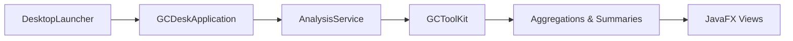
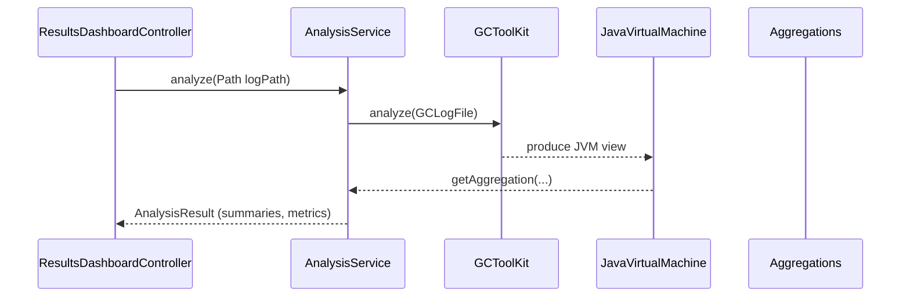

# GCToolKit Developer Guide

This guide explains how the desktop experience in this repository is organized, how the build works, and the conventions to follow when extending the platform.

## Project Layout and Module Responsibilities

| Path | Description |
| --- | --- |
| `api` | Core domain types, message bus abstractions, and the aggregation SPI that clients extend when interpreting GC events. |
| `parser` | Log readers and parser pipelines that transform raw GC log lines into strongly typed JVM event objects. |
| `vertx` | The Vert.x-based message bus implementation used in production deployments. |
| `app/app-core` | Application services, aggregations, and analytics models used by the desktop UI. Notable classes include `AnalysisService` and the domain summaries consumed by the UI layer.【F:app/app-core/src/main/java/com/yourorg/gcdesk/AnalysisService.java†L38-L136】 |
| `app/app-ui` | JavaFX front-end, controllers, and FXML layouts for the GC analysis desktop experience.【F:app/app-ui/src/main/java/com/yourorg/gcdesk/ui/GCDeskApplication.java†L1-L69】【F:app/app-ui/src/main/resources/com/yourorg/gcdesk/ui/results-dashboard.fxml†L1-L139】 |
| `app/packaging` | Launchers and platform-specific packaging glue, including the shaded entry point used for distribution.【F:app/packaging/src/main/java/com/yourorg/gcdesk/DesktopLauncher.java†L1-L17】 |
| `sample` | Stand-alone examples that demonstrate how to call the toolkit directly from the command line.【F:sample/README.md†L1-L80】 |
| `gclogs` | Curated sample logs for regression and exploratory testing. |

Each Maven module has its own `pom.xml` and can be built independently. Use the module-level POMs when iterating locally and the root `pom.xml` for full builds.

## Common Build and Verification Commands

The project can be built with Maven or Gradle, depending on the module.

- Build the full multi-module Maven project: `./mvnw clean verify`
- Execute only the desktop packaging build with Gradle (from `app/`): `./gradlew :packaging:shadowJar`
- Run unit tests in the application core: `./mvnw -pl app/app-core test`
- Generate aggregated coverage reports: `./mvnw jacoco:report`

> **Tip:** IDE import is fastest when you open the repository as a Maven project and then selectively enable the `app` modules for Gradle.

## Runtime Architecture

### Desktop Execution Flow



1. `DesktopLauncher` delegates to the JavaFX application entry point and acts as the shaded JAR's `main` method.【F:app/packaging/src/main/java/com/yourorg/gcdesk/DesktopLauncher.java†L1-L17】
2. `GCDeskApplication` wires controllers, loads FXML scenes, and coordinates the asynchronous analysis workflow.【F:app/app-ui/src/main/java/com/yourorg/gcdesk/ui/GCDeskApplication.java†L21-L69】
3. `AnalysisService` inspects the selected log (single file or rotating directory), invokes `GCToolKit`, and caches the resulting aggregations for reuse.【F:app/app-core/src/main/java/com/yourorg/gcdesk/AnalysisService.java†L44-L123】
4. Aggregations (for pause time, heap occupancy, causes, and collection cycle counts) are pulled from the `JavaVirtualMachine` instance and transformed into UI-ready summaries.【F:app/app-core/src/main/java/com/yourorg/gcdesk/AnalysisService.java†L86-L123】
5. The UI controllers update charts and tables based on the `AnalysisResult` payloads, presenting insights to the analyst.【F:app/app-ui/src/main/java/com/yourorg/gcdesk/ui/ResultsDashboardController.java†L32-L157】

### Service and Aggregation Collaboration



`AnalysisService` maintains both a cache keyed by UUID and a lookup index keyed by normalized path, so opening the same log twice reuses the previous result without reprocessing.【F:app/app-core/src/main/java/com/yourorg/gcdesk/AnalysisService.java†L50-L84】 The service converts toolkit-provided `XYDataSet` and summary types into immutable records that the UI can render safely on the JavaFX thread.【F:app/app-core/src/main/java/com/yourorg/gcdesk/AnalysisService.java†L104-L123】

## Coding Standards

- **Language level:** Modules are compiled with Java 17. Use var sparingly and prefer explicit types in public APIs.
- **Formatting:** Configure your IDE to use 4 spaces, no tabs, and wrap lines at 120 characters. Static analysis is enforced with the shared PMD ruleset and SpotBugs configuration that run as part of the Maven build, so keep your changes compliant before committing.【F:pom.xml†L255-L276】【F:pom.xml†L149-L160】【F:pmd-ruleset.xml†L1-L180】
- **Null-safety:** Leverage `Objects.requireNonNull` for mandatory parameters and `Optional` for nullable returns, following the patterns in `AnalysisService`.【F:app/app-core/src/main/java/com/yourorg/gcdesk/AnalysisService.java†L59-L121】
- **Collections:** Prefer immutable or unmodifiable views when exposing data to other modules. See the use of `Collectors.toUnmodifiableList()` in the heap occupancy transformation.【F:app/app-core/src/main/java/com/yourorg/gcdesk/AnalysisService.java†L104-L115】
- **Threading:** Cache access uses `ConcurrentHashMap`; follow the same approach for shared state and avoid synchronizing on arbitrary objects.【F:app/app-core/src/main/java/com/yourorg/gcdesk/AnalysisService.java†L46-L83】
- **Testing:** Mirror the structure in `app/app-core/src/test/java` and keep integration tests under `.../integration` packages. Favor descriptive method names and rely on the existing sample logs under `gclogs/` for fixtures.

## Extensibility Templates

### Adding a New Aggregation

1. **Define the aggregation contract** in `app/app-core/src/main/java/com/example/app/core/aggregations`:

   ```java
   @Collates(MyNewAggregator.class)
   public abstract class MyNewAggregation extends Aggregation {

       public abstract void acceptSample(DomainEvent event);
   }
   ```

2. **Implement the aggregator** that registers the events you care about. Mirror the registration pattern used for pause percentiles.【F:app/app-core/src/main/java/com/example/app/core/aggregations/DesktopPausePercentileAggregator.java†L15-L54】

   ```java
   @Aggregates(EventSource.G1GC)
   public class MyNewAggregator extends Aggregator<MyNewAggregation> {

       public MyNewAggregator(MyNewAggregation aggregation) {
           super(aggregation);
           register(MyEvent.class, event -> aggregation().acceptSample(event));
       }
   }
   ```

3. **Create the concrete summary** returned to callers, following the `DesktopGCCauseFrequencySummary` style for immutability and helper methods.【F:app/app-core/src/main/java/com/example/app/core/aggregations/DesktopGCCauseFrequencySummary.java†L1-L56】
4. **Expose the result through `AnalysisService`** by requesting the aggregation from `JavaVirtualMachine` and mapping it to your UI model.【F:app/app-core/src/main/java/com/yourorg/gcdesk/AnalysisService.java†L86-L123】
5. **Register the aggregation with the module system** in `app/app-core/src/main/resources/META-INF/services/com.microsoft.gctoolkit.aggregator.Aggregation` (create the file if needed) so `GCToolKit` can discover it.

### Adding a New UI Panel

1. **Create the FXML layout** under `app/app-ui/src/main/resources/com/yourorg/gcdesk/ui/`, using existing files such as `results-dashboard.fxml` as a pattern for structure and style hooks.【F:app/app-ui/src/main/resources/com/yourorg/gcdesk/ui/results-dashboard.fxml†L1-L88】
2. **Implement the controller** in `app/app-ui/src/main/java/com/yourorg/gcdesk/ui/` and annotate it with `@FXML` fields/methods similar to `ResultsDashboardController`. Ensure you inject the `AnalysisService` via the application context or setter during initialization.【F:app/app-ui/src/main/java/com/yourorg/gcdesk/ui/ResultsDashboardController.java†L32-L157】
3. **Update `GCDeskApplication`** to load the new view, wire controller dependencies, and add navigation or menu entries so users can reach the panel.【F:app/app-ui/src/main/java/com/yourorg/gcdesk/ui/GCDeskApplication.java†L47-L69】
4. **Style the panel** by extending `styles.css` and using the shared class names or color variables that keep the experience consistent.【F:app/app-ui/src/main/resources/com/yourorg/gcdesk/ui/styles.css†L1-L120】
5. **Write UI-level tests** or manual smoke check scripts to verify the panel responds when new `AnalysisResult` data arrives.

## Further Reading

- [`DEVELOPERS_GUIDE.md`](../DEVELOPERS_GUIDE.md) for the historical deep dive into toolkit internals.
- [`sample/README.md`](../sample/README.md) for command-line examples that directly use the `api` module.
- [`CONTRIBUTING.md`](../CONTRIBUTING.md) for governance, code-of-conduct, and review expectations.
